# The Grad–Shafranov equation, and what this project measures

This note is for reading the `fusion-gs` code with the physics in view. It assumes calculus, the Lorentz force, and ordinary Python. Every symbol is defined at first use. Numbers that come from a saved result file are quoted from that file. A few illustrative values were computed by running the project's own solver; each of those is marked, with the call that produced it.

## 1. Summary

`fusion-gs` is a small research code for axisymmetric tokamak equilibria. The equilibrium is the Grad–Shafranov equation, a nonlinear elliptic equation for a single scalar, the poloidal flux $\psi(R, Z)$. The repository builds four things on top of that equation. An exact family of solutions (Solov'ev equilibria, following Cerfon and Freidberg) checks a finite-difference solver. That solver generates thousands of synthetic plasmas. A physics-informed network learns one equilibrium, or a one-parameter family, from the differential equation alone. A supervised surrogate learns the map from nine equilibrium parameters to $\psi$ on a $65 \times 65$ grid. An inverse network goes the other way, from synthetic magnetic sensors back to $\psi$.

On the analytic test the finite-difference error is $3.06 \times 10^{-5}$ in relative L2 at $65^2$ and $6.82 \times 10^{-6}$ at $129^2$, with observed order $2.16$ on the last refinement (`outputs/compare/solver_verification.json`). The best surrogate, an MLP–CNN trained with a Grad–Shafranov penalty, has mean test relative L2 $1.09 \times 10^{-2}$, magnetic-axis error $1.4\,\mathrm{mm}$, and relative error $2.4\%$ in the edge safety factor $q_{95}$ (`outputs/compare/summary.md`). The same architecture without the physics penalty has almost the same flux error and a much worse residual, axis, and $q_{95}$. The inverse model, given only external magnetics at $1\%$ noise, has test relative L2 $0.171$. A hybrid that is handed a nearly perfect forward surrogate does no better ($0.170$). External measurements determine the plasma current and the major radius, and they do not determine the current profile. That is the old Shafranov–Lao identifiability result, recovered here as a set of $R^2$ values.

## 2. Why fusion, and why a magnetic bottle

The reaction this subject is built around is deuterium–tritium fusion,

$$
\mathrm{D} + \mathrm{T} \rightarrow {}^{4}\mathrm{He}\ (3.5\,\mathrm{MeV}) + \mathrm{n}\ (14.1\,\mathrm{MeV}).
$$

The neutron carries most of the energy out to a surrounding blanket. The helium nucleus, the alpha particle, stays behind and can heat the fuel. The cross-section is large enough to be interesting only when the ions are very fast. The temperatures people design for are about $10$–$20\,\mathrm{keV}$. Using $k_B/e = 8.617 \times 10^{-5}\,\mathrm{eV/K}$, $10\,\mathrm{keV}$ is $1.16 \times 10^{8}\,\mathrm{K}$, of order a hundred million kelvin.

A gas at that temperature cannot be held in a material box. The wall would vaporize, and contact with it would cool the fuel and pour impurities back in. The fuel is a plasma: a gas hot enough that the atoms are ionized, so every particle carries a charge. A charge $q$ moving at velocity $\mathbf{v}$ in a magnetic field $\mathbf{B}$ feels the Lorentz force $q\,\mathbf{v} \times \mathbf{B}$. The force is perpendicular to $\mathbf{v}$, so it does no work and it does not change the speed. It bends the perpendicular motion into a circle, the gyro-orbit, whose radius is $mv_\perp / (|q| B)$. Motion *along* the field is not bent. Particles are free to stream along a field line and are stuck to it in the perpendicular directions, up to that small orbit.

A straight solenoid therefore confines the plasma sideways and loses it out of the ends. Bend the solenoid into a doughnut, a torus, and the field lines close on themselves. There are no ends. That is the idea of magnetic confinement in a torus.

A purely toroidal field is not enough. The field is stronger on the inside of the torus, because the same coil current is spread around a shorter circumference, so $B_\phi \propto 1/R$. Particles drift in that gradient, and they also drift because the field line itself is curved. The two drifts depend on the sign of the charge. Ions and electrons drift in opposite vertical directions, charge separates, and an electric field grows. The $\mathbf{E} \times \mathbf{B}$ drift then pushes the whole plasma outward, charges together. A torus with only a toroidal field empties itself.

The cure is to twist the field lines. Add a poloidal field, the short way around the cross-section, to the toroidal field, the long way around the doughnut. A field line then spirals. In one poloidal trip it samples the top and the bottom of the plasma, and the vertical drifts cancel rather than accumulating. The amount of twist is the safety factor $q$, defined in Section 5.

A tokamak makes the poloidal field with a current in the plasma itself, flowing the long way around the torus. External coils still make most of the toroidal field. (A stellarator makes the twist with shaped external coils and little net plasma current. This project is about tokamaks.) The price of the tokamak's simplicity is that the plasma current, the pressure, and the shape have to satisfy a force-balance equation. That equation is Grad–Shafranov.

## 3. Equilibrium: pressure sits on magnetic surfaces

On the time scale of interest the plasma is not flying apart and it is not accelerating. Start from the momentum equation of magnetohydrodynamics. With the plasma velocity written $\mathbf{v}$ and the mass density $\rho$,

$$
\rho\left(\frac{\partial \mathbf{v}}{\partial t} + \mathbf{v}\cdot\nabla\mathbf{v}\right) = \mathbf{J}\times\mathbf{B} - \nabla p.
$$

In a static equilibrium $\mathbf{v} = 0$ and nothing depends on time, so the left side vanishes and

$$
\mathbf{J} \times \mathbf{B} = \nabla p.
$$

$\mathbf{J}$ is the current density and $p$ is the plasma pressure. Dot both sides with $\mathbf{B}$. The left side is zero because $\mathbf{B}$ is perpendicular to $\mathbf{J}\times\mathbf{B}$, so

$$
\mathbf{B}\cdot\nabla p = 0.
$$

Pressure does not change as you walk along a field line. Dot with $\mathbf{J}$ instead and, for the same reason,

$$
\mathbf{J}\cdot\nabla p = 0.
$$

The current also lies in the surfaces of constant pressure. In a torus those surfaces are nested closed tubes. They are called magnetic surfaces, or flux surfaces, because the field lines wrap around them and never cross from one to the next.

Axisymmetry makes this concrete. Use cylindrical coordinates $(R, \phi, Z)$: $R$ is the distance from the symmetry axis of the torus, $\phi$ is the angle the long way around, and $Z$ is the height. Axisymmetry means that no equilibrium quantity depends on $\phi$. It is enough to draw the poloidal plane, the $(R, Z)$ half of a cross-section, and remember that the picture is spun around the axis. In that plane, looking with $R$ to the right and $Z$ up, $\phi$ points into the page. The diagrams below use that orientation. A positive plasma current $I_p$ in this project also points into the page.

Because the field is divergence-free and axisymmetric, the poloidal part of $\mathbf{B}$ can be written as the curl of a toroidal vector potential. The usual scalar is the poloidal flux per radian, $\psi(R, Z)$, with units weber per radian in this code. The magnetic field is

$$
\mathbf{B} = \nabla\psi \times \nabla\phi + F\,\nabla\phi,
$$

where $\nabla\phi = \hat{\mathbf{e}}_\phi / R$ and $F = F(R, Z)$ is a second scalar. Component by component this is exactly the convention in `models/diagnostics.py` and `gs/solver.py`:

$$
B_R = -\frac{1}{R}\frac{\partial\psi}{\partial Z}, \qquad
B_Z = \frac{1}{R}\frac{\partial\psi}{\partial R}, \qquad
B_\phi = \frac{F}{R}.
$$

The physical poloidal flux through a horizontal circle of radius $R$ at height $Z$ is $2\pi\psi$. On the showcase equilibrium of Section 8, $\psi$ on the magnetic axis is $0.358870\,\mathrm{Wb/rad}$ (the figure rounds this to $0.3589$), so the linked flux is $2\pi\psi_\mathrm{axis} = 2.255\,\mathrm{Wb}$.

$\psi$ is constant along a field line. Indeed $\mathbf{B}\cdot\nabla\psi = 0$: the cross product $\nabla\psi \times \nabla\phi$ is perpendicular to $\nabla\psi$, and $\nabla\phi$ is perpendicular to $\nabla\psi$ because $\psi$ does not depend on $\phi$. Combined with $\mathbf{B}\cdot\nabla p = 0$, the pressure can depend on position only through $\psi$,

$$
p = p(\psi).
$$

A similar argument, written out in the next section, shows that $F$ is also a flux function, $F = F(\psi)$. One scalar field $\psi(R, Z)$, plus two ordinary functions $p(\psi)$ and $F(\psi)$, is the whole axisymmetric equilibrium.

The surfaces $\psi = \mathrm{constant}$ are the nested curves you see in every flux plot in this repository. The magnetic axis is the centre of that nest, where $\psi$ has an extremum and the poloidal field vanishes. The last closed flux surface, the LCFS, is the outermost surface that stays inside the plasma. In the fixed-boundary problems here the LCFS is prescribed, and $\psi$ is set to zero on it.

## 4. The Grad–Shafranov equation

Ampère's law in steady state is $\nabla\times\mathbf{B} = \mu_0 \mathbf{J}$, with $\mu_0 = 4\pi\times 10^{-7}\,\mathrm{H/m}$. The toroidal component, using the expressions for $B_R$ and $B_Z$ above, is

$$
\mu_0 J_\phi = \frac{\partial B_R}{\partial Z} - \frac{\partial B_Z}{\partial R}
= -\frac{1}{R}\frac{\partial^2\psi}{\partial Z^2} - \frac{\partial}{\partial R}\!\left(\frac{1}{R}\frac{\partial\psi}{\partial R}\right).
$$

Multiply through by $-R$ and you obtain the operator that the whole project calls $\Delta^\ast$,

$$
\Delta^\ast \psi \equiv R\frac{\partial}{\partial R}\!\left(\frac{1}{R}\frac{\partial\psi}{\partial R}\right) + \frac{\partial^2\psi}{\partial Z^2}
= \frac{\partial^2\psi}{\partial R^2} - \frac{1}{R}\frac{\partial\psi}{\partial R} + \frac{\partial^2\psi}{\partial Z^2}
= -\mu_0 R J_\phi.
$$

The two writings are the same identity. The finite-difference code uses the first, because it is a divergence of a flux and conserves current well on a grid. The physics-informed network uses the second, because automatic differentiation gives ordinary partial derivatives. They agree for a smooth $\psi$.

That relates $J_\phi$ to $\psi$. Force balance relates $J_\phi$ to $p$ and $F$. First, $F$ has to be a flux function. The poloidal components of Ampère's law are

$$
\mu_0 J_R = -\frac{1}{R}\frac{\partial F}{\partial Z}, \qquad
\mu_0 J_Z = \frac{1}{R}\frac{\partial F}{\partial R}.
$$

Since $p = p(\psi)$ and $\mathbf{J}\cdot\nabla p = 0$, the poloidal current is perpendicular to $\nabla\psi$ wherever $p'(\psi) \neq 0$:

$$
J_R \frac{\partial\psi}{\partial R} + J_Z \frac{\partial\psi}{\partial Z} = 0.
$$

Substitute $J_R$ and $J_Z$ and this says $\nabla F \times \nabla\psi = 0$. The gradients are parallel, so $F = F(\psi)$.

Now the radial component of $\mathbf{J}\times\mathbf{B} = \nabla p$. With $B_Z = (1/R)\,\partial\psi/\partial R$, $B_\phi = F/R$, and $J_Z = F'(\psi)\,(1/(\mu_0 R))\,\partial\psi/\partial R$,

$$
J_\phi B_Z - J_Z B_\phi = p'(\psi)\,\frac{\partial\psi}{\partial R}
$$

becomes, after dividing out $\partial\psi/\partial R$,

$$
J_\phi = R\, p'(\psi) + \frac{F F'(\psi)}{\mu_0 R}.
$$

(The prime is a derivative with respect to $\psi$, not $R$.) Put this into $\Delta^\ast\psi = -\mu_0 R J_\phi$ and the Grad–Shafranov equation is

$$
\Delta^\ast \psi = -\mu_0 R^2 p'(\psi) - F(\psi)\,F'(\psi).
$$

Each term on the right-hand side is $-\mu_0 R$ times one piece of $J_\phi$. The piece $R p'(\psi)$ is the toroidal current that $\mathbf{J}\times\mathbf{B}$ needs in order to hold up $\nabla p$. The piece $FF'(\psi)/(\mu_0 R)$ is the toroidal current that comes with a poloidal current, and the poloidal current is what changes the toroidal field from its vacuum value. In the sign convention of this repository, $\psi$ is largest on the magnetic axis when $I_p > 0$, and $p'(\psi) > 0$ means pressure rises toward the axis. $FF' > 0$ then means $F$ itself rises toward the axis: $B_\phi$ in the core is stronger than the vacuum toroidal field $R_0 B_0 / R$. That is a paramagnetic equilibrium. A diamagnetic equilibrium, with $F$ smaller on axis, would need $FF' < 0$. The profile family in Section 7 never produces that sign.

The equation is elliptic for the same reason a Poisson equation is elliptic: $\Delta^\ast$ is a second-order operator with the sign of the Laplacian, and with $\psi$ fixed on a closed boundary the solution is unique for a given right-hand side. It is nonlinear because $p'$ and $FF'$ depend on the unknown $\psi$. You cannot write the right-hand side until you know the surfaces. The practical algorithm is Picard iteration: guess $\psi$, evaluate the current, solve the linear elliptic equation, under-relax, and repeat.

Two boundary-value problems sit on this equation. In the fixed-boundary problem the shape of the LCFS is given, $\psi$ is prescribed there (zero, in this code), and the profile functions are given. The unknown is $\psi$ inside. In the free-boundary problem the coils are given and the LCFS is not. The plasma boundary becomes the surface that passes through an X-point, or that is tangent to a limiter, and outside the plasma one solves $\Delta^\ast\psi = 0$ together with the coil fields. Almost every learned model in this repository is fixed-boundary. The FreeGS dataset in Section 7.4 is the exception.

## 5. The quantities the figures are built from

The magnetic axis is the extremum of $\psi$ inside the plasma. Here that extremum is a maximum, $\psi_\mathrm{axis} > 0$, and it sits near the midplane. It is not at the geometric centre $(R_0, 0)$. The outward displacement

$$
\Delta_s = R_\mathrm{axis} - R_0
$$

is the Shafranov shift. A toroidal current loop wants to expand, and plasma pressure pushes the same way, so the nest of surfaces is squeezed outward. On the showcase equilibrium drawn in `equilibrium.png`, $\Delta_s = +0.0799\,\mathrm{m}$ on a minor radius $a = 0.60\,\mathrm{m}$.

The LCFS is the boundary curve. Inside it the surfaces are closed and nested. The normalized flux used everywhere in the code is

$$
\psi_n = \frac{\psi - \psi_\mathrm{axis}}{\psi_\mathrm{boundary} - \psi_\mathrm{axis}}.
$$

With $\psi_\mathrm{boundary} = 0$ and $\psi_\mathrm{axis} > 0$ this is $0$ on the axis and $1$ on the LCFS. Profiles are plotted against $\psi_n$ so that plasmas of different size and current can be compared. Do not confuse $\psi_n$ with the analytic Solov'ev flux $\bar\psi$ of Section 7.2. $\bar\psi$ is negative inside the plasma. $\psi_n$ is a shape coordinate in $[0, 1]$.

The safety factor measures the twist. Follow a field line until it has gone once around the short way. The number of long-way turns it made is $q$. On a surface of constant $\psi$,

$$
q(\psi_n) = \frac{F}{2\pi} \oint \frac{\mathrm{d}l}{R^2 B_p},
$$

where the integral is once around the poloidal contour, $B_p = |\nabla\psi| / R$ is the poloidal field strength, and $\mathrm{d}l$ is arc length. $F$ comes out of the integral because it is constant on the surface. Large $q$ means little twist. The code evaluates this in `eval/metrics.py` by drawing the contour on a refined grid and integrating with segment midpoints. It refuses $\psi_n = 0$ and $\psi_n = 1$, where $B_p$ vanishes or the contour degenerates, and reports $q_{95} = q(0.95)$ instead of an edge value. That convention is the usual one on real devices as well: at a diverted X-point $B_p \to 0$ and $q$ diverges, so the value at $95\%$ of the flux is the number people quote.

Two round numbers are worth remembering, as stability facts rather than as something this code computes. The Kruskal–Shafranov limit concerns the edge: the external kink is unstable if $q$ at the boundary drops below $1$, and in practice tokamaks operate with $q_{95}$ around $3$ or higher, partly to keep the $q = 2$ surface (where the $m = 2$, $n = 1$ mode lives) away from the edge. In the core, a $q = 1$ surface inside the plasma allows the $m = 1$ internal kink, which in real tokamaks shows up as periodic "sawtooth" crashes of the central temperature. Many tokamaks run with $q_0$ slightly below $1$ and tolerate sawteeth, but it is a real effect. The showcase equilibrium in Section 8 has $q(0.05) = 0.662$ and $q_{95} = 4.955$: the edge is comfortably safe, and the core would be sawtoothing. Nothing in the dataset generator rejects a solution for its $q$ profile. These are equilibria, not stability-checked scenarios.

The shape of the boundary is described by three numbers. $R_0$ is the major radius of the geometric centre and $a$ is the minor radius, half the width of the cross-section. The inverse aspect ratio is $\varepsilon = a/R_0$. Elongation $\kappa$ is the height divided by the width: $\kappa = 1$ is circular, and the showcase uses $\kappa = 1.7$. Triangularity $\delta$ pulls the top and bottom tips inward toward the axis. The curve the solver aims at is the up–down symmetric Miller shape

$$
R = R_0 + a\cos(\tau + \arcsin(\delta)\,\sin\tau), \qquad
Z = \kappa a \sin\tau,
$$

with $\tau$ running from $0$ to $2\pi$. The boundary that is actually imposed is not this curve pointwise. It is the zero contour of a Solov'ev solution that is required to pass through the inner equator, the outer equator, and the top of the Miller curve, and to match the curvature there (Cerfon and Freidberg). For the shapes in the dataset the two curves are close. Panel (d) of `profiles_and_shapes.png` shows the Miller targets.

Plasma beta is the ratio of plasma pressure to magnetic pressure, $\beta = 2\mu_0 \langle p\rangle / B^2$. Poloidal beta $\beta_p$ uses the poloidal field, which is the field the plasma current itself produces. The figure code defines

$$
\beta_p = \frac{2\langle p\rangle \ell^2}{\mu_0 I_p^2},
$$

with $\ell$ the length of the LCFS and $\langle p\rangle$ the area average of the pressure. The combination $\mu_0 I_p / \ell$ is the characteristic poloidal field from Ampère's law around the boundary. On the showcase plasma $\beta_p = 0.540$. That number is not the input $\beta_0$. Section 7 explains $\beta_0$; it is a mix parameter in the current profile. They happen to be numerically close for that one plasma.

Internal inductance $l_i$ measures how peaked the toroidal current is, through the magnetic energy stored in the poloidal field inside the plasma. A centrally peaked current has large $l_i$. The code never evaluates $l_i$. It matters for the inverse problem because, for a circular large-aspect-ratio plasma, external magnetic measurements determine the sum $\beta_p + l_i/2$ and not the two terms separately (Shafranov; the shaped-plasma version is in Lao et al., the EFIT paper). Section 7.7 is that fact, measured on this dataset.

## 6. Why a fast solve is worth having

A tokamak control system recomputes, or at least corrects, the equilibrium many times a second. Vertical position control in particular has to be fast: the plasma can be unstable to a vertical drift on a millisecond time scale, and the coils have to push back. Between shots, and in scenario design, one also wants hundreds or thousands of equilibria: scans in shape, current, and pressure. Equilibrium reconstruction, the EFIT procedure of Lao et al. (1985), solves an inverse Grad–Shafranov problem so that the synthetic magnetic signals match the measured ones, often with extra internal data.

The finite-difference solve in this repository is already cheap. One nonlinear $65\times 65$ equilibrium takes $44.3\,\mathrm{ms}$ on the machine that produced `outputs/compare/speed.json`. A trained network evaluates one equilibrium in about $1$–$3\,\mathrm{ms}$, and the best surrogate evaluates a batch of $500$ in $273\,\mathrm{ms}$, which is $0.55\,\mathrm{ms}$ each. The honest reading is that a $65\times 65$ fixed-boundary Picard solve does not need to be replaced for speed. The interesting uses of the learned maps are elsewhere: a batch scan, a free-boundary solve that is much more expensive than this one, and the inverse problem, where the network is a fast guess inside a family it has seen. Degrave et al. (Nature, 2022) showed that a learned controller can hold the shape and position of the TCV tokamak; that work is about control, not about solving Grad–Shafranov, but it is the reason millisecond magnetic models are taken seriously.

What a network cannot do is invent information. The inverse experiments below are a measurement of how much of $\psi$ the external sensors actually contain.

## 7. What the code actually does

### 7.1 Conventions

The shared conventions are written at the top of `gs/solver.py`.

Arrays on a grid have shape `(nr, nz)` with NumPy `indexing="ij"`, so `psi[i, j]` lives at `(R[i], Z[j])`. Units are SI: metres, amperes, tesla, $\psi$ in Wb/rad, $J$ in A/m$^2$. The equation is $\Delta^\ast\psi = -\mu_0 R J_\phi$. For the solver, the datasets, the surrogates, and the inverse model, $\psi = 0$ on the boundary and $\psi_\mathrm{axis} > 0$ when $I_p > 0$. The analytic Solov'ev flux $\bar\psi$ has the opposite sign: it is negative inside and zero on the boundary. The Solov'ev physics-informed network learns that negative sign. The solver-verification test compares the finite-difference solution of the analytic right-hand side against $\bar\psi$, so in that one test the reference flux is negative. Everywhere else a positive $I_p$ means a positive $\psi$ on axis.

The toroidal current profile, the same form FreeGS uses in `ConstrainBetapIp`, is

$$
J_\phi = \lambda \left(\beta_0 \frac{R}{R_0} + (1-\beta_0)\frac{R_0}{R}\right) \left(1 - \psi_n^{\alpha}\right)^{\gamma}
$$

inside the plasma and zero outside. $\lambda$ is not a free input. Each iteration it is rescaled so that $\int J_\phi\,\mathrm{d}A = I_p$. The two geometric factors are the pressure piece, proportional to $R$, and the $FF'$ piece, proportional to $1/R$. Matching coefficients with $J_\phi = R p' + FF'/( \mu_0 R)$ gives

$$
p'(\psi) = \lambda\,\frac{\beta_0}{R_0}\, g(\psi_n), \qquad
FF'(\psi) = \mu_0 \lambda (1-\beta_0) R_0\, g(\psi_n),
$$

where $g = (1 - \psi_n^\alpha)^\gamma$. For $\beta_0$ between $0$ and $1$ both $p'$ and $FF'$ are non-negative. $F$ is then recovered by integrating $FF'$ inward from the boundary condition $F(1) = R_0 B_0$, and the pressure by integrating $p'$ inward from $p = 0$ on the boundary. $B_0$ sets the toroidal field at the edge. It does not appear in $J_\phi$, and it does not change $\psi$ in a fixed-boundary solve. It changes $q$, because $q$ is proportional to $F$.

$\alpha$ and $\gamma$ shape $g$. Larger $\alpha$ holds $g$ near $1$ until $\psi_n$ is well away from the axis, then lets it fall. Larger $\gamma$ makes the fall steeper. Panel (c) of the profile figure shows three examples from the training range.

### 7.2 Analytic Solov'ev equilibria

If $p'$ and $FF'$ are both constant, the right-hand side of Grad–Shafranov is a linear function of $R^2$. In the normalized coordinates $x = R/R_0$, $y = Z/R_0$ the Cerfon–Freidberg form used here is

$$
x\frac{\partial}{\partial x}\!\left(\frac{1}{x}\frac{\partial\bar\psi}{\partial x}\right) + \frac{\partial^2\bar\psi}{\partial y^2} = (1 - A) x^2 + A.
$$

$A$ is a single number that mixes the constant pressure term and the constant $FF'$ term. The general up–down symmetric solution is a particular polynomial, $\bar\psi_p = x^4/8 + A(x^2 \ln x / 2 - x^4/8)$, plus seven homogeneous solutions with free coefficients. Those seven numbers are fixed by $\bar\psi = 0$ at the outer equator, the inner equator, and the top of the Miller curve, by a zero-slope condition at the top, and by three curvature conditions. `gs/analytic.py` builds the linear system with SymPy and solves it numerically.

Exact solutions are the cleanest test a discretization can have. There is no iteration error and no profile-modelling error, so whatever is left is the grid. They also give the physics-informed network a known answer without ever showing it that answer during training. The benchmark copied from the paper's ITER-like example is $\varepsilon = 0.32$, $\kappa = 1.7$, $\delta = 0.33$, $A = -0.155$, $R_0 = 1$. Evaluated with `solovev(...).psi` on an $81\times 81$ grid over $R \in [0.5, 1.5]$, $Z \in [-0.7, 0.7]$, the analytic flux inside the plasma reaches a minimum of $-0.03697$. The fixed-boundary *shapes* elsewhere in the project use the same machinery with $A = 0$, which the solver docstring records as giving one closed negative region over the whole parameter box.

### 7.3 The finite-difference solver

`solve_fixed_boundary` in `gs/solver.py` is Picard iteration on a uniform grid. The linear problem $\Delta^\ast\psi = \mathrm{rhs}$ is a sparse matrix, factored once with SuperLU and re-solved every iteration. The first guess is a spatially constant $J_\phi$ equal to $I_p$ over the plasma area. After that, $J_\phi$ is recomputed from the current $\psi$, $\lambda$ is set by the integral constraint, and the new flux is under-relaxed with weight $0.5$:

$$
\psi \leftarrow 0.5\,\psi_\mathrm{new} + 0.5\,\psi_\mathrm{old}.
$$

The loop stops when the maximum relative change in $\psi$ drops below $10^{-8}$, or at $200$ iterations. The showcase equilibrium below converged in $63$ iterations. The magnetic axis is then refined by a local quadratic fit so that it is not stuck on a grid node.

A curved boundary does not pass through grid nodes. If the code pretended the boundary sat on the nearest node, the geometric error would be first order and the global error would fall short of second order. The stencil used here is the Shortley–Weller idea (1938). On a link that crosses the boundary, the derivative is written with the true distance $h$ from the interior node to the boundary, found by a scalar root solve, instead of the full grid spacing. The resulting three-point formula is exact for quadratics. The local truncation error stays $O(h^2)$, and so does the global error, which the analytic test confirms.

That test solves the Solov'ev right-hand side on the box $R \in [0.45, 1.55]$, $Z \in [-0.85, 0.85]$ and compares with $\bar\psi$ inside the plasma (`outputs/compare/solver_verification.json`):

| grid | $h = \max(\Delta R, \Delta Z)$ | relative L2 | observed order |
| --- | --- | --- | --- |
| $33^2$ | $0.05312\,\mathrm{m}$ | $1.362\times 10^{-4}$ | — |
| $65^2$ | $0.02656\,\mathrm{m}$ | $3.059\times 10^{-5}$ | $2.155$ |
| $129^2$ | $0.01328\,\mathrm{m}$ | $6.822\times 10^{-6}$ | $2.165$ |

The dashed line in `solver_convergence.png` is a slope of $2$ drawn through the finest point. The measured slope sits slightly above $2$. With three grids and a curved boundary, that is what a second-order scheme looks like. On this linear problem the $65^2$ relative error is $3.06\times 10^{-5}$. The learned models are scored against the discrete solver, and their flux errors are orders of magnitude larger, so the grid is not what limits those comparisons.

### 7.4 The datasets

Fixed-boundary samples are drawn by scrambled Sobol sequences, which fill a box in several dimensions more evenly than independent random points. The nine inputs and their in-distribution ranges (`data/generate.py`) are:

| parameter | range | role |
| --- | --- | --- |
| $R_0$ | $1.5$–$1.9\,\mathrm{m}$ | geometric major radius |
| $\varepsilon = a/R_0$ | $0.25$–$0.40$ | inverse aspect ratio; $a = \varepsilon R_0$ is what is stored |
| $\kappa$ | $1.2$–$2.0$ | elongation |
| $\delta$ | $0$–$0.5$ | triangularity |
| $I_p$ | $0.5$–$2.0\,\mathrm{MA}$ | plasma current |
| $\beta_0$ | $0.2$–$0.8$ | fraction of $J_\phi$ in the pressure term |
| $\alpha$ | $0.8$–$2.5$ | current-profile exponent |
| $\gamma$ | $1.0$–$3.0$ | current-profile exponent |
| $B_0$ | $1.5$–$3.0\,\mathrm{T}$ | vacuum-field scale, $F(1) = R_0 B_0$ |

Five thousand solves were requested and five thousand were kept: the inverse metrics record $4000$ train, $500$ validation, and $500$ test. Every plasma lives on one shared grid, $R \in [0.80, 2.76]\,\mathrm{m}$, $Z \in [-1.90, 1.90]\,\mathrm{m}$, $65\times 65$. The spacings are $\Delta R = 0.030625\,\mathrm{m}$ and $\Delta Z = 0.059375\,\mathrm{m}$. The box was chosen so that even the most elongated plasma in the out-of-distribution set sits several cells inside the boundary.

The out-of-distribution file is another $500$ Sobol samples with the same ranges except $\kappa \in (2.0, 2.3]$, and every row is labelled test. The point of the file is extrapolation: the networks never train on elongation above $2$, and $2.3$ was checked to keep the level set a single closed curve and the solver convergent. The Sobol stream uses a different seed offset so the file is not a copy of the training set with $\kappa$ edited.

The free-boundary set is FreeGS on its `TestTokamak` coil set (`P1L`, `P1U`, `P2L`, `P2U`), on $R \in [0.1, 2.0]$, $Z \in [-1.0, 1.0]$, again $65\times 65$. Inputs are a poloidal beta, $I_p$ from $0.1$ to $0.4\,\mathrm{MA}$, a vacuum-field parameter, two profile exponents, and X-point locations jittered around a double-null example, with about $30\%$ of the attempts forced to a single null. A sample is kept only if the solve finishes, the current matches $I_p$ to $2\%$, the core mask is sane, $q_{95}$ lies in $(0.5, 40)$, and the measured shape is physical. Of $600$ attempts, $298$ were kept and split $238/30/30$. Just over half the solves were dropped. The file is a small free-boundary collection on one toy machine, which is the right way to read the FreeGS inverse numbers later.

### 7.5 The physics-informed network

A physics-informed neural network (Raissi, Perdikaris, and Karniadakis, 2019) represents $\psi(R, Z)$ by a neural network and trains the weights so that the differential equation and the boundary condition hold at collocation points. No solved equilibrium is used as a target inside the domain. The network here is a multilayer perceptron: $5$ hidden layers of width $64$, hyperbolic tangent, inputs mapped affinely onto $[-1, 1]$, float64 arithmetic. $\Delta^\ast\psi$ is built with automatic differentiation from the expanded form $\partial_R^2\psi - R^{-1}\partial_R\psi + \partial_Z^2\psi$. The loss is a normalized mean square of $\Delta^\ast\psi - \mathrm{rhs}$, plus a weight $w_b$ times the mean square of $\psi$ on the boundary. Boundary points are the true zero contour of the level set, found by ray bisection, so the network is pinned to the geometry rather than to a nearby Miller polyline.

Training is Adam for a few hundred steps, then L-BFGS. The budget requested in the saved runs is $5000$ steps. L-BFGS stopped earlier: $700$ Adam steps and $1122$ L-BFGS closures for the Solov'ev case, $95\,\mathrm{s}$ of training (`outputs/pinn/solovev_metrics.json`).

Three cases were trained.

The Solov'ev case is the analytic equilibrium of Section 7.2. The right-hand side is the known function of $R$, and the reference used for scoring is $\bar\psi$. On the $129^2$ evaluation grid the relative L2 inside the plasma is $3.15\times 10^{-4}$, the maximum pointwise error is $2.31\times 10^{-5}$, and the largest $|\psi|$ on the boundary samples is $2.47\times 10^{-6}$. The boundary is satisfied tightly. The interior relative error is about $46$ times the finite-difference error on the same $129^2$ grid ($3.15\times 10^{-4}$ against $6.82\times 10^{-6}$). The network is a useful representation of this one solution. The finite-difference solution on that grid is the more accurate of the two.

The nonlinear case is the showcase equilibrium: $R_0 = 1.7\,\mathrm{m}$, $a = 0.6\,\mathrm{m}$, $\kappa = 1.7$, $\delta = 0.3$, $I_p = 1\,\mathrm{MA}$, $\beta_0 = 0.5$, $\alpha = 1$, $\gamma = 2$, $B_0 = 2\,\mathrm{T}$. Because the right-hand side depends on $\psi$, the training is itself a Picard loop. A constant-current warm start is followed by six lagged updates of $\psi_\mathrm{axis}$ and $\lambda$. The reference is a finite-difference solution of the same equilibrium, not an analytic formula. Relative L2 is $8.48\times 10^{-3}$, the maximum pointwise error is $4.09\times 10^{-3}\,\mathrm{Wb/rad}$, and the magnetic-axis error is $5.03\,\mathrm{mm}$ (mostly in $Z$: the reference axis is on the midplane and the network axis is $4.49\,\mathrm{mm}$ low). The predicted $\psi_\mathrm{axis}$ is $0.3560$ against a reference $0.3588$, and $\lambda$ is off by a relative $0.835\%$. This is a qualitatively right equilibrium with a percent-level flux error, visibly worse than the linear analytic case. One forward pass on a $65^2$ grid takes $2.05\,\mathrm{ms}$, after $88\,\mathrm{s}$ of training that produced a network for this single plasma.

The parametric case adds $A$ as an input, trained at five values in $[-0.3, 0.1]$ and scored at four values it did not train on: $-0.27$, $-0.155$, $-0.05$, and $0.05$. The mean relative L2 on those four is $1.55\times 10^{-3}$; the worst is $1.94\times 10^{-3}$ at $A = -0.05$. The mean magnetic-axis error over the four is $0.338\,\mathrm{mm}$ (`outputs/compare/pinn_summary.json`). A one-parameter family of linear equilibria is well inside the reach of this small network. A nine-parameter family of nonlinear equilibria is what the surrogate in the next section is for.

### 7.6 The supervised surrogate

The surrogate is an ordinary regression from the nine parameters to the $65\times 65$ field $\psi$, trained on the $4000$ solved equilibria. Two architectures are in `models/surrogate.py`.

The MLP–CNN encodes the nine numbers with a small fully connected network, reshapes them into an $8\times 8$ feature image, and decodes with three stride-2 transposed convolutions up to $64\times 64$, then a bilinear resize to $65\times 65$. A final convolution also sees the normalized coordinates $(R, Z)$ and the parameters broadcast over the grid. That last step matters: a plain convolutional stack is translation-equivariant, and a tokamak is not. The plasma sits at a particular $R$. This model has $629002$ parameters.

The Fourier neural operator (Li et al., 2021) lifts a field of channels — the parameters broadcast in space, the coordinates, and the plasma mask — into a width-$16$ representation, applies three Fourier layers that keep $8$ modes, and projects back to one channel. It has $202786$ parameters. It is handed the mask, so it is told the boundary geometry directly. The comparison below is between these two specific sizes, trained for $36$ epochs (MLP–CNN) or $24$ epochs (FNO). It is not a general verdict on the two families.

Both models predict a shape and a scale separately. A head predicts $\log\psi_\mathrm{axis}$, the spatial network predicts the dimensionless field $\psi / \psi_\mathrm{axis}$, and the physical flux is the product. On this dataset $\psi_\mathrm{axis}$ varies by about an order of magnitude because $I_p$ and the plasma size vary, while the shape inside the mask stays in $[0, 1]$. Dividing by the per-sample axis value stops the loss from being dominated by the high-current plasmas. An extra mean-square penalty on $\log\psi_\mathrm{axis}$ stops the shape and the scale from trading off against each other.

The optional physics term is

$$
w_\mathrm{phys}\,\frac{\|\Delta^\ast \psi_\mathrm{pred} + \mu_0 R J_\mathrm{true}\|^2}{\|\mu_0 R J_\mathrm{true}\|^2},
$$

evaluated on nodes whose four neighbours are also inside the plasma, with the same conservative stencil as the solver. $w_\mathrm{phys}$ is $0$ for the first few epochs and then $0.1$. The denominator makes the weight dimensionless. The true current is used, so this term asks the predicted flux to be consistent with the current of the equilibrium it is copying. It is not a free-standing solver.

Mean errors on the $500$ test equilibria, and on the $500$ high-elongation equilibria, from `outputs/surrogate/summary.json`:

| run | test rel L2 | OOD rel L2 | test GS residual | test axis error | test $q_{95}$ rel | test LCFS failures |
| --- | --- | --- | --- | --- | --- | --- |
| mlpcnn, $w=0$ | $1.42\times 10^{-2}$ | $2.15\times 10^{-2}$ | $0.977$ | $8.36\,\mathrm{mm}$ | $0.136$ | $55/500$ |
| mlpcnn, $w=0.1$ | $1.09\times 10^{-2}$ | $1.86\times 10^{-2}$ | $0.0327$ | $1.40\,\mathrm{mm}$ | $0.0243$ | $0/500$ |
| fno, $w=0$ | $2.46\times 10^{-2}$ | $3.89\times 10^{-2}$ | $0.564$ | $5.77\,\mathrm{mm}$ | $0.260$ | $132/500$ |
| fno, $w=0.1$ | $2.11\times 10^{-2}$ | $3.64\times 10^{-2}$ | $0.0510$ | $3.39\,\mathrm{mm}$ | $0.274$ | $82/500$ |

$q_{95}$ here uses the true $F(\psi_n)$ and the predicted geometry, on $50$ test equilibria. The relative error is $|q_\mathrm{pred} - q_\mathrm{true}| / |q_\mathrm{true}|$ at $\psi_n = 0.95$. LCFS error is the symmetric mean distance between the contours $\psi = 10^{-3}\psi_\mathrm{axis}$, and the failure count is how often that contour could not be drawn around the axis. The mean LCFS distance for the best model is $13.0\,\mathrm{mm}$ on all $500$ test plasmas. For the MLP–CNN without the physics term the mean is $36.2\,\mathrm{mm}$, and it is computed only on the $445$ contours that succeeded, so it is an optimistic summary of a model that also fails outright on $55$ plasmas.

Read the MLP–CNN pair first. Relative L2 only moves from $1.42\%$ to $1.09\%$. The Grad–Shafranov residual drops by a factor of thirty, from $0.977$ to $0.0327$. The axis error drops from $8.4\,\mathrm{mm}$ to $1.4\,\mathrm{mm}$, and the relative $q_{95}$ error from $14\%$ to $2.4\%$. The same pattern, weaker, is there in the FNO residual and the FNO axis. The FNO $q_{95}$ error does not improve ($0.260$ to $0.274$). A physics penalty is not automatically helpful for every derived quantity on every architecture.

The residual can move so much while L2 barely moves because $\Delta^\ast$ is a second-derivative operator. A small, rapid wiggle in $\psi$ costs little in an L2 norm and a great deal once two derivatives hit it. $q$ and the axis location are sensitive to the same derivatives: $B_p$ is $|\nabla\psi|/R$, and the axis is a critical point of $\psi$. An L2-only fit is free to leave high-frequency error that those quantities notice.

This is easy to see on a single solved equilibrium. Take the showcase plasma on the $129^2$ nonlinear-PINN box, $R \in [0.90, 2.55]\,\mathrm{m}$ and $Z \in [-1.25, 1.25]\,\mathrm{m}$, add a perturbation whose relative L2 against $\psi$ is exactly $0.01$, and recompute `eval.metrics.gs_residual` against the unchanged $-\mu_0 R J$. A smooth Gaussian bump of width $0.35\,\mathrm{m}$ produces a normalized residual of $8.84\times 10^{-3}$. A grid-scale checkerboard, $\sin(\pi R/\Delta R)\sin(\pi Z/\Delta Z)$ masked to the plasma, produces a residual of $23.3$. The same $1\%$ of flux error changes the residual by a factor of $2.64\times 10^{3}$ when it is oscillatory. The unperturbed solver residual on that equilibrium is $1.5\times 10^{-8}$, so the discrete solution does satisfy the discrete equation. The physics loss is a way of telling the network that the second kind of error is unacceptable even when the flux plot looks fine.

Out of distribution, at $\kappa \in (2.0, 2.3]$, the best model goes from $1.09\times 10^{-2}$ to $1.86\times 10^{-2}$ in relative L2 and from $1.40\,\mathrm{mm}$ to $2.30\,\mathrm{mm}$ in axis error. The degradation is real and it is not a collapse. Without the physics term the OOD axis error is $22.4\,\mathrm{mm}$, and $86$ of $500$ LCFS contours fail. The FNO out of distribution fails the LCFS contour on $372$ of $500$ plasmas even with the physics term. Elongation past the training range is mostly a shape-generalization test, and the coordinate-aware CNN with the residual penalty is the one that keeps the surfaces usable.

On speed, `outputs/compare/speed.json` is the comparison to use. One $65\times 65$ nonlinear solve of the showcase equilibrium takes $44.32\,\mathrm{ms}$. One sample through `mlpcnn_pw0p1` takes $1.05\,\mathrm{ms}$. A batch of the $500$ test plasmas takes $273.42\,\mathrm{ms}$. The training-time logs inside each surrogate metrics file quote a different single-solve time, about $27\,\mathrm{ms}$, because that timer wrapped a different call. Both are "tens of milliseconds." Neither makes the finite-difference solver look slow. The batch throughput is where the surrogate is actually cheaper, and only after the $241\,\mathrm{s}$ of training for that checkpoint.

### 7.7 The inverse model

Reconstruction runs the map backwards. The sensors are a synthetic diagnostic set, `SensorSet` in `models/diagnostics.py`, sitting on a closed vessel. For the fixed-boundary data the vessel is a D-shaped contour inset just inside the grid box, outside every plasma in the training file and in the elongation file. The channels, $101$ of them, are:

- $40$ pickup coils measuring the tangential poloidal field $B_t = \mathbf{B}\cdot\hat{\mathbf{t}}$,
- $40$ pickup coils measuring the outward normal field $B_n = \mathbf{B}\cdot\hat{\mathbf{n}}$,
- $20$ flux loops measuring $\psi$ at points on the vessel,
- one Rogowski coil, which is the vessel contour itself and returns the total toroidal current inside it.

The response of a sensor to the plasma is a Green's function. A unit toroidal filament at $(R_c, Z_c)$ produces poloidal flux per radian

$$
\psi = \frac{\mu_0}{2\pi}\sqrt{R R_c}\,\frac{(2 - k^2) K(k^2) - 2 E(k^2)}{k},
$$

$$
k^2 = \frac{4 R R_c}{(R + R_c)^2 + (Z - Z_c)^2},
$$

with $K$ and $E$ the complete elliptic integrals. $B_R$ and $B_Z$ are central differences of this flux with a step of $10^{-3}\,\mathrm{m}$, the same step FreeGS uses. The code comments that this step is a few parts in $10^5$ relative to the analytic derivative, well below the $1\%$ sensor noise. The full response matrix $G$ has one column per grid cell. Signals are $G$ times the cell currents $J\,\Delta R\,\Delta Z$. Because the stored fixed-boundary flux is zero outside the plasma, these sensors see the plasma current only. There are no poloidal-field coils in the fixed-boundary sensor model. The Rogowski row of $G$ is $1$ on cells inside the vessel and $0$ outside, so its signal is $I_p$.

Noise is independent Gaussian noise on each channel with standard deviation equal to `noise` times that channel's root-mean-square over the training set. The saved model used `noise = 0.01`. Inputs to the network include the raw signals, the same signals divided by the Rogowski channel, and the log of the Rogowski signal, so the current amplitude and the shape of the magnetic pattern are separate features. Poloidal-field coil currents are appended for the FreeGS model.

The selected architecture is the direct one (`outputs/inverse/metrics.json`, $48$ epochs, $508\,\mathrm{s}$). An MLP encodes the diagnostics to a latent vector. A convolutional decoder, the same skeleton as the surrogate, predicts the shape $\psi/\psi_\mathrm{axis}$, and a scalar head predicts $\log\psi_\mathrm{axis}$. A second head predicts the equilibrium parameters. That head is what the $R^2$ numbers below are measuring. It is not the path that produces $\psi$ in the direct model. The loss includes the flux error, the parameter error, and a small Grad–Shafranov penalty of weight $0.05$ against the true current.

On the fixed-boundary test split the relative L2 of $\psi$ is $0.1707$ (median $0.151$). The validation and training relative L2 values are $0.1751$ and $0.1688$. The network is not overfitting. The magnetic-axis error is $6.06\,\mathrm{mm}$, the LCFS distance is $65.6\,\mathrm{mm}$ on the $454$ contours that succeeded ($46$ failed), the Grad–Shafranov residual is $0.205$, and the absolute $q_{95}$ error is $1.403$ on $50$ equilibria. That $q_{95}$ comparison, like the surrogate one, uses the true $F$ built from the true parameters. The error is entirely from the geometry of the predicted $\psi$. An absolute error of $1.4$ on a quantity that is typically a few units is a different statement from the surrogate's $2.4\%$ relative error. Out of distribution the flux error is $0.1894$ and the absolute $q_{95}$ error is $1.436$.

The noise sweep is the first clue that this floor is not the noise:

| relative noise | in-distribution rel L2 | OOD rel L2 | FreeGS rel L2 |
| --- | --- | --- | --- |
| $0$ | $0.1704$ | $0.1882$ | $0.1142$ |
| $0.01$ | $0.1707$ | $0.1894$ | $0.1154$ |
| $0.03$ | $0.1777$ | $0.1953$ | $0.1192$ |
| $0.05$ | $0.1887$ | $0.2040$ | $0.1244$ |

From clean signals to $1\%$ noise the test error moves in the fourth digit. At $5\%$ noise it has risen from $0.170$ to $0.189$. The reconstruction was already $17\%$ wrong with perfect measurements.

The parameter $R^2$ on clean signals (`param_r2_clean` in the same file) says what is wrong:

| parameter | clean $R^2$ | $R^2$ at $1\%$ noise |
| --- | --- | --- |
| $I_p$ | $0.999$ | $0.999$ |
| $R_0$ | $0.961$ | $0.960$ |
| $\delta$ | $0.578$ | $0.488$ |
| $\kappa$ | $0.515$ | $0.494$ |
| $a$ | $0.434$ | $0.429$ |
| $\gamma$ | $0.407$ | $0.391$ |
| $\alpha$ | $0.219$ | $0.218$ |
| $\beta_0$ | $0.002$ | $0.000$ |
| $B_0$ | $-0.026$ | $-0.026$ |

$R^2 = 1$ would mean the parameter is recovered perfectly. $R^2 = 0$ means the prediction is no better than guessing the training mean. A slightly negative value means it is a little worse than that.

$I_p$ is essentially perfect because the Rogowski coil measures it. $R_0$ is well determined because the external field pattern knows where the current sits. The boundary parameters are only partly visible: the vessel is well outside the plasma, and more than one shape can produce a similar external field. $\alpha$ and $\gamma$, which set the radial shape of the current, are weakly determined. $\beta_0$ is not determined at all.

That last fact is the classical one. External magnetics respond to the poloidal field outside the plasma. By Ampère's law they fix the total current. They also fix, for a circular plasma, the combination $\beta_p + l_i/2$, because a broader current (lower internal inductance) and a higher poloidal beta can be arranged to leave the same field at the wall. Shaping separates the two only weakly, which is why EFIT with magnetics alone is not trusted for the current profile (Lao et al., 1985). In this parameterization $\beta_0$ is the knob that trades pressure against the $FF'$ part of the current, and $\alpha$, $\gamma$ move the peaking. The $R^2$ values are that degeneracy, restricted to the profile family the network was shown. $B_0$ has $R^2 \approx 0$ for a simpler reason: it never enters $\psi$, and none of these sensors measure $B_\phi$.

The hybrid experiment closes the argument. A second network maps the sensors to the nine parameters and then through the frozen `mlpcnn_pw0p1` surrogate, which itself has test relative L2 $0.0109$ when it is given the true parameters. The hybrid's test relative L2 is $0.1696$. The direct decoder's is $0.1707$. Feeding a much more accurate forward model does not move the flux error. The floor is the part of the equilibrium the sensors do not determine. A production reconstruction adds internal constraints that this sensor set leaves out: motional Stark effect measurements of the local field-line pitch, which constrain $q$ and hence the current profile, and Thomson scattering or other kinetic measurements of the pressure.

The FreeGS inverse is a different and smaller experiment. It trains on $238$ equilibria, tests on $30$, and is given the four poloidal-field coil currents as well as the magnetic signals. Test relative L2 is $0.1154$, the axis error is $12.1\,\mathrm{mm}$, and the LCFS distance is $17.3\,\mathrm{mm}$ on $28$ of $30$ contours. The $q_{95}$ score is empty, $30$ failures out of $30$, because the scoring routine builds $F(\psi)$ from the fixed-boundary parameter names and a FreeGS row does not have them. That is a missing metric, not thirty plasmas with no safety factor. The lower flux error should not be lined up against $0.171$ as a win. The coil currents are known inputs, the machine is one fixed coil set, and the test set has $30$ rows. One `reconstruct` call takes $1.20\,\mathrm{ms}$ for either checkpoint.

## 8. How to read the figures

The two diagrams that were drawn for this note, rather than copied from `outputs/`, are `tokamak_cross_section.png` and `profiles_and_shapes.png`. Both were made by `docs/figures/make_diagrams.py` with the project's solver. The cross-section solves the showcase equilibrium on the shared fixed-boundary box $R \in [0.80, 2.76]$, $Z \in [-1.90, 1.90]$ at $129\times 129$, and overlays `SensorSet.for_grid` for that box. The profile figure solves the same shape at $\beta_0 = 0.2$, $0.5$, and $0.8$ on a $97^2$ grid in the box $R \in [0.90, 2.55]$, $Z \in [-1.25, 1.25]$, and draws Miller curves from the formula in Section 5.

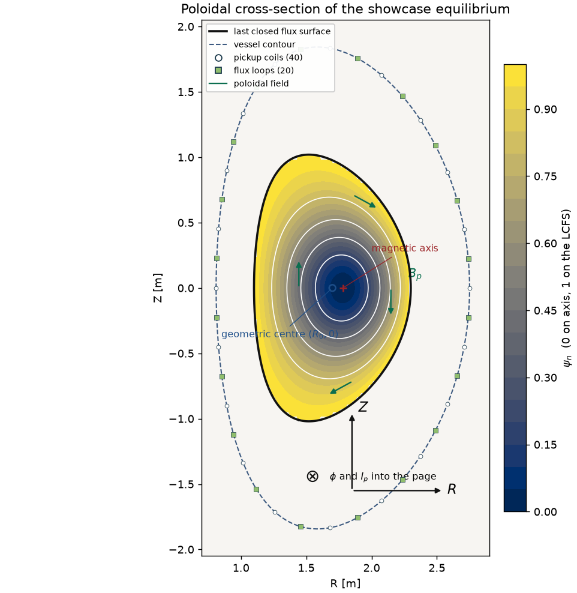

In the cross-section, $R$ increases to the right and $Z$ upward. The symbol $\otimes$ is $\phi$, into the page, and it is also the direction of $I_p$. The colour is $\psi_n$: dark at the axis, light at the edge. The black curve is the LCFS. The red cross is the magnetic axis and the open circle is the geometric centre $(R_0, 0)$; the gap between them is the Shafranov shift, outward. The green arrows are $\mathbf{B}_p$ from $B_R = -R^{-1}\partial_Z\psi$ and $B_Z = R^{-1}\partial_R\psi$. They run clockwise, which is the right-hand rule for a current into the page. The dashed curve is the vessel. Open circles are the $40$ pickup locations (each carries a tangential and a normal measurement) and green squares are the $20$ flux loops. The Rogowski coil is the vessel loop, not an extra dot. The sensors sit well outside the plasma. That gap is why the inverse problem is hard: the diagnostic is looking at the field after it has fallen off, and many interior current distributions share nearly the same exterior.

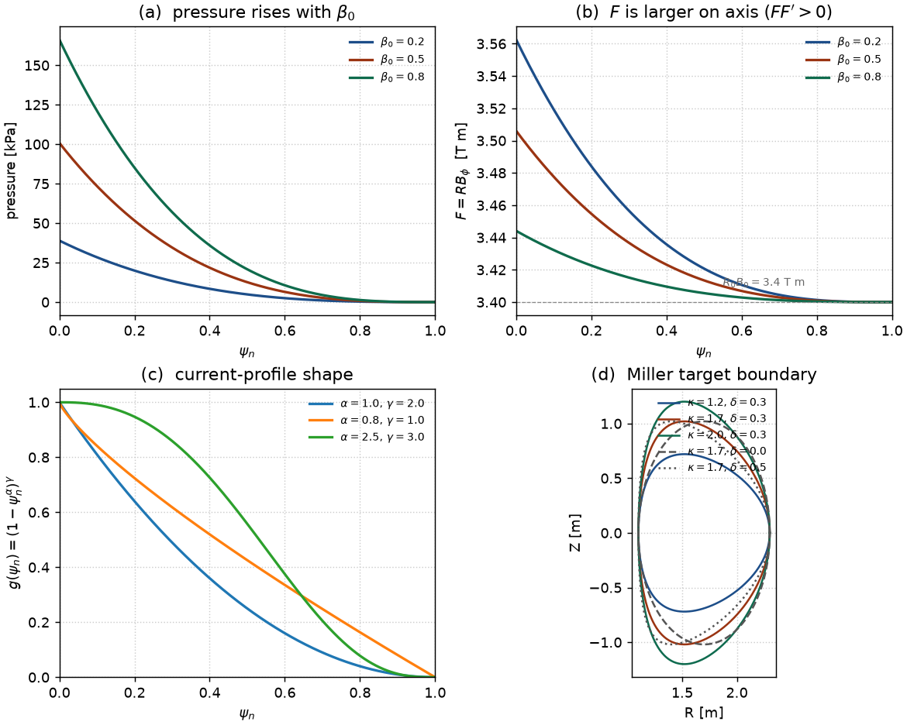

Panel (a) is pressure against $\psi_n$ at three values of $\beta_0$, with $I_p$, $B_0$, and the shape held at the showcase values. Axis pressure rises from $39.0\,\mathrm{kPa}$ at $\beta_0 = 0.2$ to $101\,\mathrm{kPa}$ at $\beta_0 = 0.5$ and $166\,\mathrm{kPa}$ at $\beta_0 = 0.8$. Panel (b) is $F = R B_\phi$. Every curve ends at $R_0 B_0 = 3.40\,\mathrm{T\,m}$ and is larger on axis: $3.563$, $3.506$, and $3.444\,\mathrm{T\,m}$. Raising $\beta_0$ raises the pressure and shrinks the paramagnetic bump, because $(1-\beta_0)$ multiplies $FF'$. The Shafranov shift on this grid grows with $\beta_0$: $0.054\,\mathrm{m}$, $0.080\,\mathrm{m}$, $0.104\,\mathrm{m}$. Panel (c) is only the shape function $g(\psi_n)$, so it does not require a solve. Panel (d) is the Miller target at fixed $R_0 = 1.7\,\mathrm{m}$ and $a = 0.6\,\mathrm{m}$. Increasing $\kappa$ stretches the cross-section vertically. Increasing $\delta$ pulls the tips toward smaller $R$ and makes the D shape.

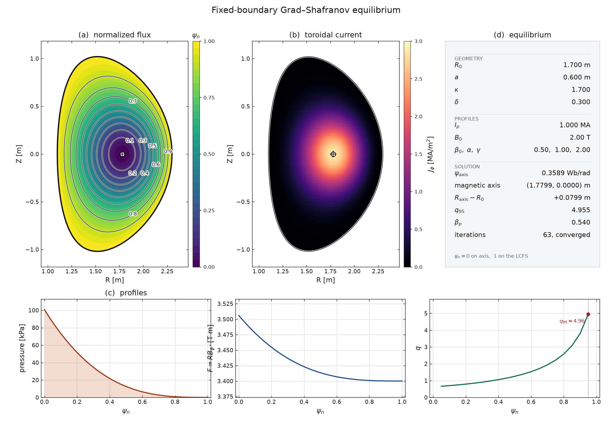

`equilibrium.png` is the default case of `eval.visualize`: the showcase parameters, solved on the $129^2$ covering grid that the script builds around the plasma ($R$ from $0.823$ to $2.577\,\mathrm{m}$, $Z$ from $-1.458$ to $1.458\,\mathrm{m}$). The numbers below are that solve.

Panel (a) is $\psi_n$ with nine labelled surfaces from $0.1$ to $0.9$, the LCFS in black, and the axis marked. The surfaces are up–down symmetric and shifted outward. Panel (b) is $J_\phi$ in MA/m$^2$, clipped to the LCFS. The peak on this solve is $2.87\,\mathrm{MA/m^2}$, which is why the colour scale tops out at $3$. The current is peaked on the axis because $g = (1-\psi_n)^2$ for $\alpha = 1$, $\gamma = 2$. Panel (c) has three profile plots against $\psi_n$. Pressure falls from $100.8\,\mathrm{kPa}$ on axis to zero at the edge. For a density scale, take that pressure as $n_e kT_e + n_i kT_i$ with $n_e = n_i$ and $T_e = T_i = 10\,\mathrm{keV}$, so $kT = 1.602\times 10^{-15}\,\mathrm{J}$. Then $n_e = p / (2kT) \approx 3.15\times 10^{19}\,\mathrm{m}^{-3}$. The equilibrium itself carries no temperature; this only converts the pascals. $F$ falls from $3.506\,\mathrm{T\,m}$ on axis to $3.400\,\mathrm{T\,m}$ at the edge, a $3\%$ paramagnetic rise toward the core; the vertical axis of the plot is zoomed, so the slope looks steeper than it is. $q$ rises from $0.662$ at $\psi_n = 0.05$ to $q_{95} = 4.955$. The core is below the Kruskal–Shafranov value. Panel (d) is the bookkeeping: geometry, profiles, $\psi_\mathrm{axis} = 0.3589\,\mathrm{Wb/rad}$, axis at $(1.7799, 0)\,\mathrm{m}$, shift $+0.0799\,\mathrm{m}$, $\beta_p = 0.540$, and $63$ iterations to convergence. The integral of $J_\phi$ on this grid recovers $I_p = 1.000\,\mathrm{MA}$, and the discrete Grad–Shafranov residual of the solved field is $1.50\times 10^{-8}$.

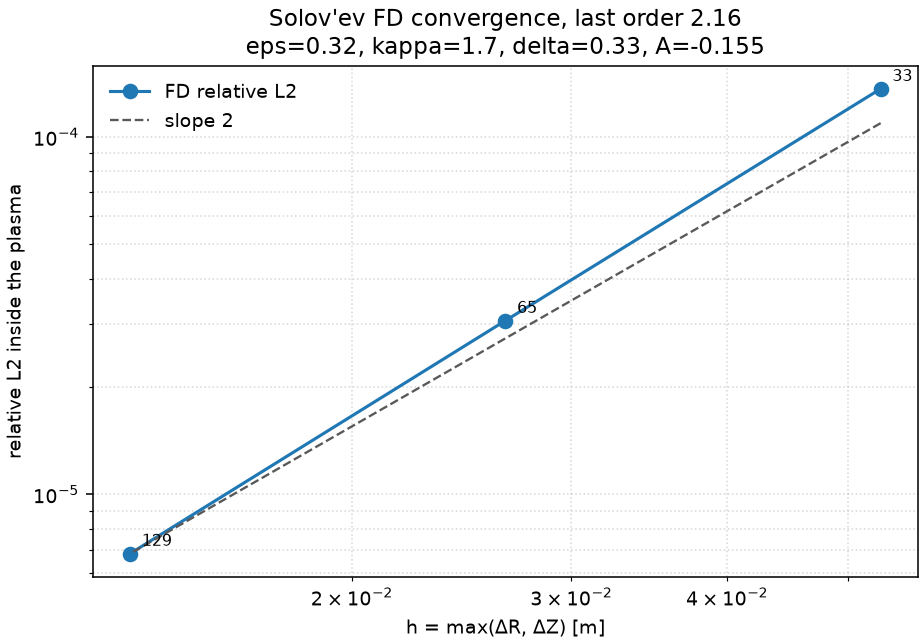

`solver_convergence.png` is the table in Section 7.3. Relative L2 inside the plasma against $\bar\psi$, on a log–log plot versus grid spacing. The slope matches the reference line of order $2$. The point labels are the number of nodes on a side.

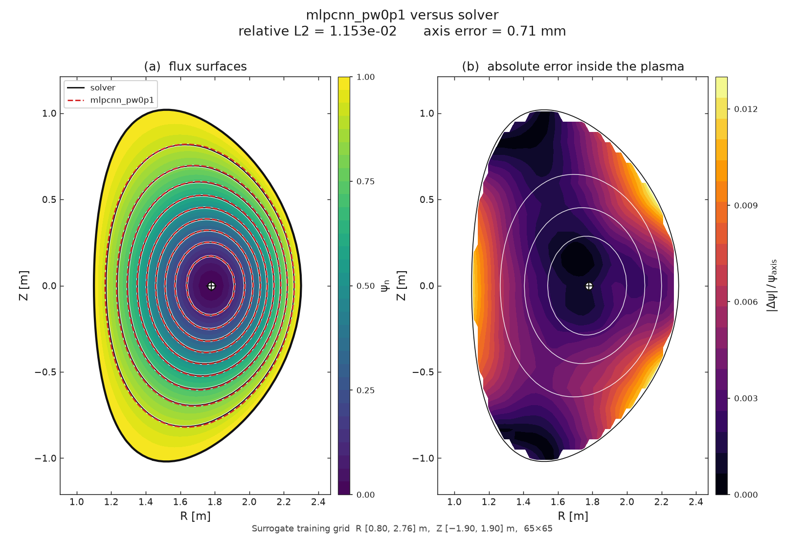

`surrogate_vs_solver.png` is `mlpcnn_pw0p1` on the showcase equilibrium, evaluated on the $65\times 65$ training grid. Solid contours are the solver and dashed contours are the network. The title reports relative L2 $1.153\times 10^{-2}$ and an axis error of $0.71\,\mathrm{mm}$ for this particular plasma. Those are one sample, not the test-set means ($1.09\times 10^{-2}$ and $1.40\,\mathrm{mm}$). A single plasma can land on either side of the mean. Panel (b) is $|\Delta\psi| / \psi_\mathrm{axis}$ inside the LCFS. The error is a few parts in a thousand over most of the core and larger toward the edge, where the colour scale reaches about $0.013$. The surfaces in panel (a) still lie on top of each other at the width of the line.

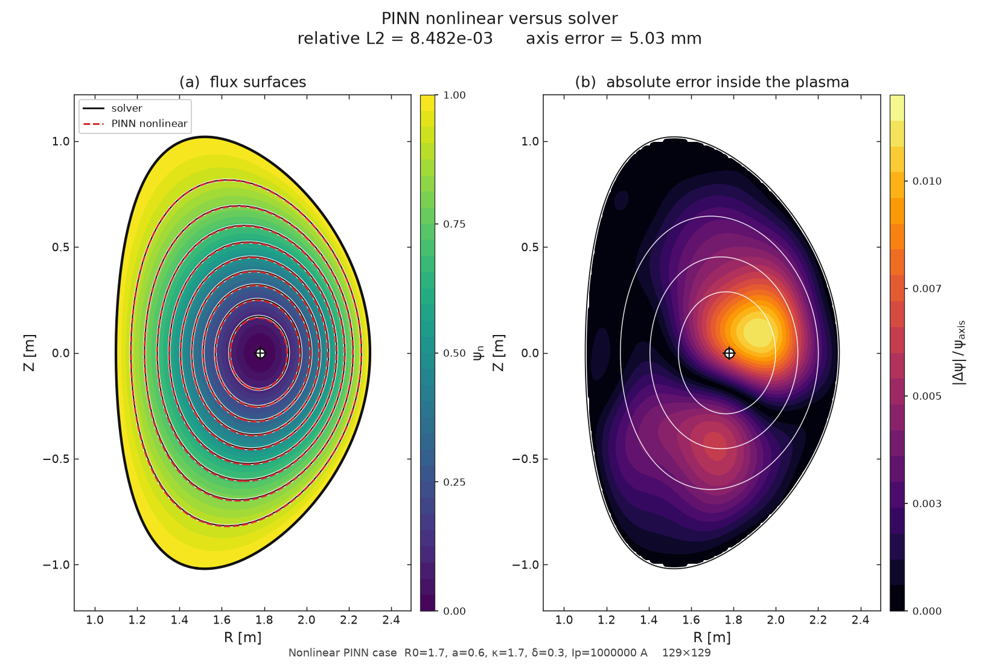

`pinn_vs_solver.png` is the nonlinear physics-informed network on the same parameters, at $129^2$. The title matches the metrics file: relative L2 $8.48\times 10^{-3}$, axis error $5.03\,\mathrm{mm}$. The flux surfaces again agree closely. The error panel is less uniform than the surrogate's: there is a localized patch near the axis at about one percent of $\psi_\mathrm{axis}$, consistent with the $4.5\,\mathrm{mm}$ vertical axis error. This network was trained on the equation for this one plasma. The surrogate was trained on four thousand plasmas and happens to be a bit worse on this particular flux norm and better on the axis.

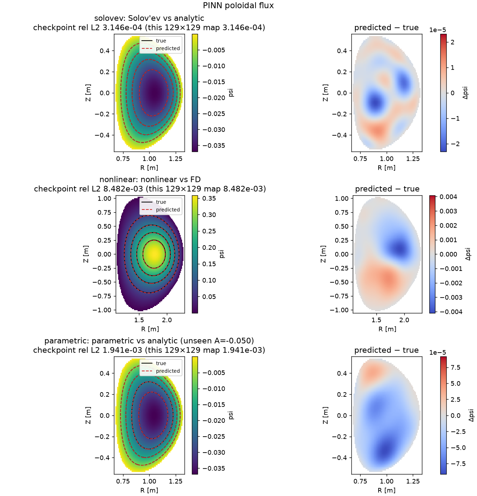

`pinn_comparison.png` stacks the three physics-informed cases. Each row is the reference flux with the network contour over it, and the pointwise error. Solov'ev and nonlinear use the full reference. The parametric row is the worst unseen value, $A = -0.05$, whose relative L2 is $1.94\times 10^{-3}$. The axis error printed by the comparison code for that single panel is not the $0.338\,\mathrm{mm}$ mean over all four unseen values; the mean is the number in the summary table.

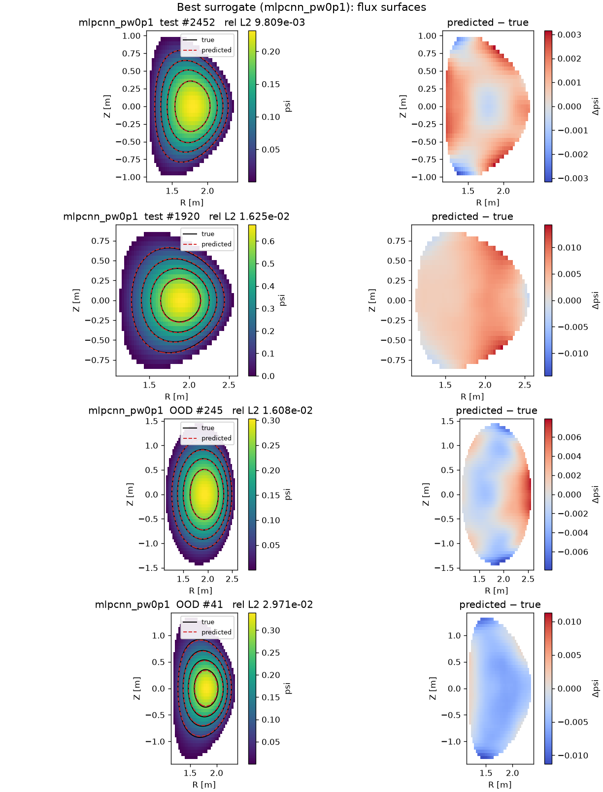

`surrogate_samples.png` is the best surrogate on four plasmas chosen by flux error: the median and the 90th percentile of the test split, then the same two quantiles of the high-elongation set. The indices and the relative L2 are in the panel titles (test $\#2452$ at $9.81\times 10^{-3}$, test $\#1920$ at $1.63\times 10^{-2}$, OOD $\#245$ at $1.61\times 10^{-2}$, OOD $\#41$ at $2.97\times 10^{-2}$). Black contours are the solver and dashed contours are the network. The right column is the signed error $\psi_\mathrm{pred} - \psi_\mathrm{true}$. Even the worst of these four still has the right topology: one axis, nested surfaces, the boundary in the right place. The error changes sign across the plasma rather than being a pure scale mistake, which is what the separate $\psi_\mathrm{axis}$ head was meant to prevent.

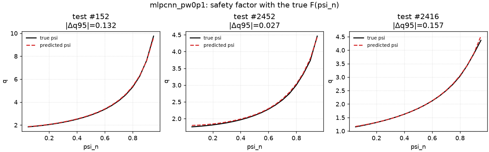

`surrogate_q.png` is $q(\psi_n)$ for three test plasmas of the same model, using the true $F$. The panels are test $\#152$, $\#2452$, and $\#2416$, with absolute $q_{95}$ errors $0.132$, $0.027$, and $0.157$ written on the figure. The curves overlie each other. These three were chosen as quartiles of the *flux* error, and their $q_{95}$ errors happen to sit around the test-set mean absolute error of $0.087$. The plot is evidence that a one-percent flux error, for this model, moves $q$ by a few hundredths, provided $F$ is known exactly. It is not evidence about an error in $F$.

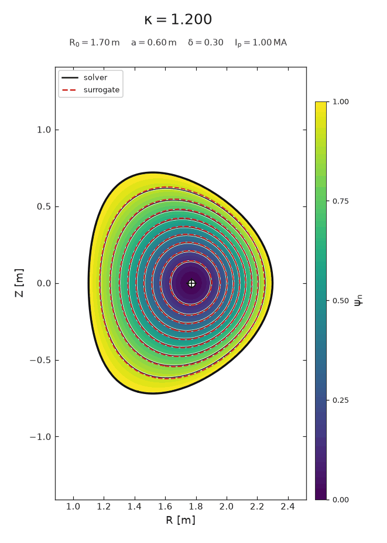

`kappa_sweep.gif` is $24$ frames of the showcase equilibrium with $\kappa$ running from $1.2$ to $2.0$ and every other parameter fixed. Solid contours are the solver and dashed contours are the surrogate. The axes are held fixed so the plasma is seen to grow taller. Through the training range the dashed curves track the solid ones. The out-of-distribution test, $\kappa$ up to $2.3$, is the numerical version of pushing this animation past its last frame; the numbers are in Section 7.6. The triangularity animation was left out of this folder to keep the size down. It is the same script with $\delta$ from $0$ to $0.5$.

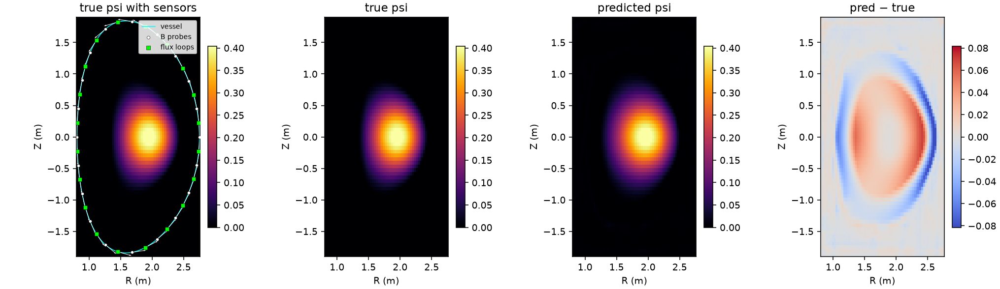

`inverse_reconstruction.png` is one fixed-boundary reconstruction. The first panel is the true $\psi$ with the vessel, the pickup coils, and the flux loops. The second is the true flux, the third is the network, and the fourth is the difference. The predicted plasma is in the right place and has the right sign, and the error map is a smooth redistribution at several hundredths of a Wb/rad, on a flux whose axis value is a few tenths. That is the visual form of a $0.17$ relative L2: the gross current and position are there, and the internal distribution is not.

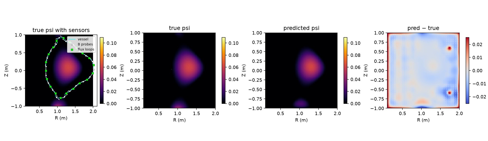

`inverse_freegs_reconstruction.png` is the same four panels for one free-boundary sample. The vessel is the TestTokamak wall, and the network was also given the four poloidal-field coil currents.

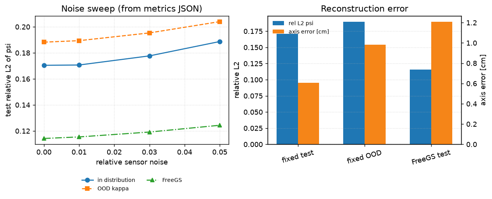

`inverse_summary.png` is the noise table and the headline errors. The left panel is almost flat between $0$ and $1\%$ noise for all three datasets, then bends up. The right panel compares relative L2 (left axis) with axis error in centimetres (right axis). Fixed-boundary test and OOD have the larger flux error and the smaller axis error. The FreeGS test has a smaller flux error and an axis error of about $1.2\,\mathrm{cm}$. Axis error and flux error are not substitutes for each other.

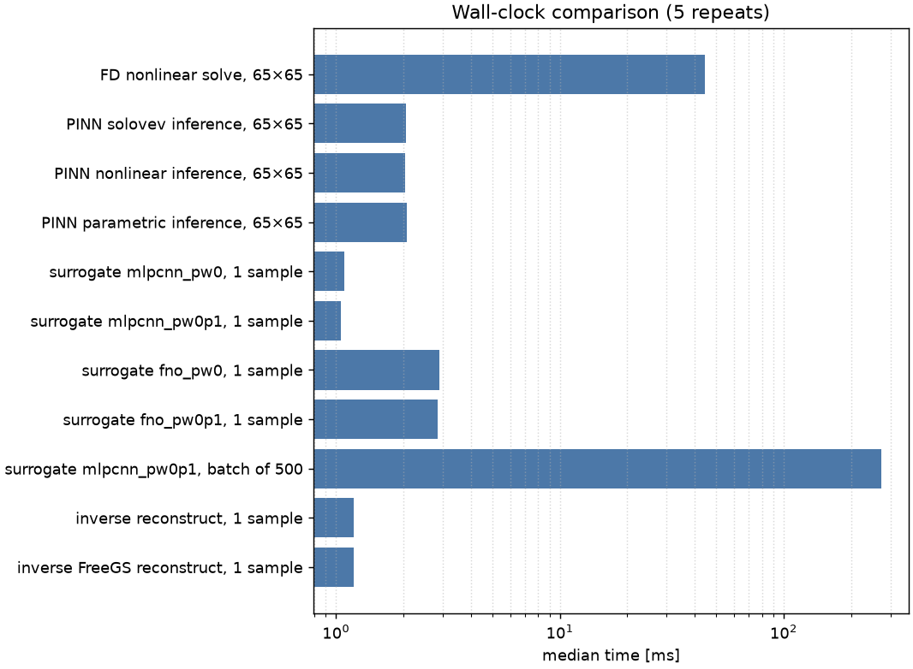

`speed.png` is the median of five calls after one warm-up, with PyTorch limited to two threads. The nonlinear solve is the long bar. Every network forward pass is a few milliseconds. The batch of $500$ is the one network bar that reaches hundreds of milliseconds, and per plasma it is the cheapest of all.

## 9. What the numbers mean

The comparison below is `outputs/compare/summary.md`, with the same rounding that file uses. Relative L2 for the learned models is inside the plasma. Surrogate $q_{95}$ errors are relative. The inverse $q_{95}$ error is absolute, because that is what its metrics file stores. Times are the medians from `speed.json`.

| model | what it is asked | rel L2 of $\psi$ | axis error | $q_{95}$ error | time |
| --- | --- | --- | --- | --- | --- |
| finite difference, Solov'ev, $65^2$ | match the analytic flux | $3.06\times 10^{-5}$ | — | — | — |
| finite difference, nonlinear, $65^2$ | the reference solve | reference | — | — | $44.3\,\mathrm{ms}$ |
| PINN, Solov'ev | one linear equilibrium | $3.15\times 10^{-4}$ | $0.047\,\mathrm{mm}$ | — | $2.06\,\mathrm{ms}$ |
| PINN, nonlinear | one nonlinear equilibrium | $8.48\times 10^{-3}$ | $5.03\,\mathrm{mm}$ | — | $2.05\,\mathrm{ms}$ |
| PINN, parametric | four unseen $A$ | $1.55\times 10^{-3}$ mean | $0.338\,\mathrm{mm}$ | — | $2.07\,\mathrm{ms}$ |
| MLP–CNN, no physics | parameters to $\psi$ | $1.42\times 10^{-2}$ (OOD $2.15\times 10^{-2}$) | $8.36\,\mathrm{mm}$ | $0.136$ rel | $1.09\,\mathrm{ms}$ |
| MLP–CNN, physics $0.1$ | parameters to $\psi$ | $1.09\times 10^{-2}$ (OOD $1.86\times 10^{-2}$) | $1.40\,\mathrm{mm}$ | $0.0243$ rel | $1.05\,\mathrm{ms}$ |
| FNO, no physics | parameters to $\psi$ | $2.46\times 10^{-2}$ (OOD $3.89\times 10^{-2}$) | $5.77\,\mathrm{mm}$ | $0.260$ rel | $2.89\,\mathrm{ms}$ |
| FNO, physics $0.1$ | parameters to $\psi$ | $2.11\times 10^{-2}$ (OOD $3.64\times 10^{-2}$) | $3.39\,\mathrm{mm}$ | $0.274$ rel | $2.84\,\mathrm{ms}$ |
| inverse, fixed boundary | $101$ sensors, $1\%$ noise | $0.171$ (OOD $0.189$) | $6.06\,\mathrm{mm}$ | $1.40$ abs | $1.20\,\mathrm{ms}$ |
| inverse, FreeGS | sensors plus coil currents | $0.115$ | $12.1\,\mathrm{mm}$ | — | $1.20\,\mathrm{ms}$ |

A relative L2 of $3\times 10^{-5}$ is the solver agreeing with an exact solution. It is the right standard for the discretization, and it is a much tighter standard than any of the learned models reach.

A relative L2 near $10^{-2}$, with the physics penalty, keeps the magnetic axis to a millimetre or two and $q_{95}$ to a few percent when $F$ is known. For drawing flux surfaces, for a coarse parameter scan, or for a warm start, that is enough. For a stability calculation that cares whether $q = 1$ or $q = 2$ sits at a particular radius, a few percent on $q_{95}$ is starting to matter, and the absolute $q_{95}$ error of the inverse model is already past that line.

A relative L2 of $0.17$ from external magnetics is a successful demonstration of a limit. The network found $I_p$ and $R_0$, placed the axis to $6\,\mathrm{mm}$, and could not see $\beta_0$. Training longer, or routing the prediction through a better surrogate, does not create the missing measurement. The useful next instrument is an internal one.

Two traps are worth naming because the tables invite them. The FreeGS inverse's $0.115$ is not a better inverse model in general; it is thirty plasmas on one coil set with the coil currents handed to the network. The solver's $44\,\mathrm{ms}$ is not a slow equilibrium code; it is a fixed-boundary Picard iteration on a modest grid, and the networks are fast relative to that specific baseline.

## 10. Limitations

The learned models see synthetic fixed-boundary equilibria. The shapes are up–down symmetric Solov'ev contours fitted to a Miller target. The current profile is the two-exponent family above, with $\beta_0$ in $[0.2, 0.8]$, so $FF' > 0$ on every sample and the toroidal field is always paramagnetic. There is no scrape-off layer, no X-point in the fixed-boundary set, no time dependence, and no stability calculation. A plasma in the training set can have $q < 1$ on axis, as the showcase does.

The FreeGS collection is the `TestTokamak` coil set, $298$ kept equilibria out of $600$ attempts, with a $30$-row test split. It is a check that the inverse pipeline runs on a free-boundary code, not a survey of free-boundary equilibria.

The networks are small and were trained on CPU: physics-informed width $64$, surrogate MLP–CNN $629002$ parameters, FNO $202786$ parameters. The physics-informed nets cover one equilibrium or a one-parameter linear family. The surrogate's physics term uses the true current, so it regularizes a regression; it does not let the surrogate run without a solved $J_\phi$.

The sensors are external and synthetic. They have no drifts, no misalignment, and no metallic-wall currents. The fixed-boundary sensor model has no poloidal-field coils. The inverse $q_{95}$ error is computed with the true $F$, and the FreeGS $q_{95}$ comparison does not run.

## 11. Things worth trying next

The cleanest next experiment is to add one internal measurement to the inverse model and watch $\beta_0$, $\alpha$, and $\gamma$. A synthetic motional Stark effect channel is a local measurement of the magnetic pitch angle $B_p / B_\phi$, which is essentially a constraint on $q$. Even a handful of pitch angles, with noise, should move the $R^2$ of the profile parameters and should drop the hybrid flux error below the $0.17$ floor. A synthetic pressure profile, the Thomson-scattering analogue, should do the same for $\beta_0$ specifically, because pressure breaks the $\beta_p$–$l_i$ trade.

A free-boundary surrogate is a larger step. The inputs become coil currents and profile parameters, the boundary is an output, and the natural grid is the FreeGS box rather than the fixed-boundary box. The present FreeGS file is too small to train the architectures in Section 7.6. Generating a few thousand kept equilibria, and recording why the other half fail, would make that model meaningful.

Up–down asymmetric shapes need the odd Cerfon–Freidberg basis functions, which the analytic module does not include yet. Single-null diverted plasmas are the experimentally relevant version. Public equilibrium databases, once the profiles are expressed in a form the solver can accept, are the way out of a purely synthetic test. An ensemble or a last-layer uncertainty estimate would show, plasma by plasma, the difference between "the network is unsure" and "the sensors do not know," which the noise sweep only shows on average.

Smaller exercises, using only what is already in the repository: plot $q(\psi_n)$ for the showcase equilibrium and mark $q = 1$ and $q = 2$; rerun the $\beta_0$ scan in `make_diagrams.py` and confirm that the Shafranov shift grows with pressure; read one row of `param_r2_clean` and say which sensor is responsible for it.

## 12. How to reproduce

From the `fusion-gs` directory, after `pip install -r requirements.txt`, the README has the exact commands that regenerate the datasets, the three physics-informed cases, the four surrogate runs, the inverse model, and `python -m eval.compare`. The figures in `outputs/visualize/` come from `python -m eval.visualize`. The two diagrams in this folder come from `PYTHONPATH=. python docs/figures/make_diagrams.py`. Training is marked slow in the tests; `python3 -m pytest -q -m 'not slow'` is the fast check. PyTorch is limited to two threads in the timing runs.

## 13. Glossary

| symbol or term | meaning in this project |
| --- | --- |
| $R, \phi, Z$ | cylindrical coordinates: major-radius distance, toroidal angle, height |
| $\psi$ | poloidal flux per radian, Wb/rad. Zero on the LCFS and positive on axis for $I_p > 0$, except for the analytic $\bar\psi$ |
| $\bar\psi$ | Cerfon–Freidberg Solov'ev flux. Negative inside, zero on the boundary |
| $\psi_n$ | $(\psi - \psi_\mathrm{axis}) / (\psi_\mathrm{boundary} - \psi_\mathrm{axis})$. Zero on axis, one on the LCFS |
| $\Delta^\ast$ | $R \partial_R(R^{-1}\partial_R \psi) + \partial_Z^2\psi$, equal to $-\mu_0 R J_\phi$ |
| $F$ | $R B_\phi$, a flux function. $F(1) = R_0 B_0$. Increases toward the axis because $FF' > 0$ |
| $p(\psi)$ | plasma pressure, constant on flux surfaces, zero on the boundary in these solves |
| $\beta_0$ | weight of the pressure term in $J_\phi$, between the $R$ piece and the $R_0/R$ piece. Not $\beta_p$ |
| $\alpha, \gamma$ | exponents in $g(\psi_n) = (1 - \psi_n^\alpha)^\gamma$ |
| $\lambda$ | scale of $J_\phi$, chosen so the area integral equals $I_p$ |
| $I_p$ | total toroidal plasma current |
| $B_0$ | scale of the vacuum toroidal field. Does not change fixed-boundary $\psi$ |
| $R_0, a, \varepsilon$ | geometric major radius, minor radius, $a/R_0$ |
| $\kappa, \delta$ | elongation and triangularity of the Miller target |
| LCFS | last closed flux surface, the plasma boundary in these problems |
| magnetic axis | extremum of $\psi$; a maximum here |
| Shafranov shift | $R_\mathrm{axis} - R_0$, outward in these equilibria |
| $q, q_{95}$ | safety factor; $q$ at $\psi_n = 0.95$ |
| $\beta_p$ | poloidal beta, $2\langle p\rangle \ell^2 / (\mu_0 I_p^2)$ in the figure code |
| $l_i$ | internal inductance. Not computed. Appears in the combination $\beta_p + l_i/2$ that external magnetics constrain |
| $A$ | Solov'ev mix parameter between the constant $p'$ term and the constant $FF'$ term |
| relative L2 | $\|\psi_\mathrm{pred} - \psi\| / \|\psi\|$ inside the plasma mask |
| GS residual | $\|\Delta^\ast\psi - \mathrm{rhs}\| / \|\mathrm{rhs}\|$ on interior plasma nodes |
| PINN | physics-informed neural network: train on the PDE and the boundary, with no interior solution target |
| FNO | Fourier neural operator |
| EFIT | the standard equilibrium-reconstruction fit to magnetic, and optionally internal, data |
| Rogowski coil | a loop enclosing the plasma, measuring the total toroidal current |
| Sobol sequence | a low-discrepancy sampling of a parameter box |

## 14. References

H. Grad and H. Rubin, "Hydromagnetic equilibria and force-free fields," *Proceedings of the Second United Nations International Conference on the Peaceful Uses of Atomic Energy*, Geneva, 1958, Vol. 31, p. 190.

V. D. Shafranov, "On magnetohydrodynamical equilibrium configurations," *Sov. Phys. JETP* **6**, 545 (1958).

V. D. Shafranov, "Plasma equilibrium in a magnetic field," *Reviews of Plasma Physics*, Vol. 2, Consultants Bureau (1966).

A. J. Cerfon and J. P. Freidberg, ""One size fits all" analytic solutions to the Grad–Shafranov equation," *Phys. Plasmas* **17**, 032502 (2010).

J. P. Freidberg, *Ideal MHD*, Cambridge University Press (2014).

J. P. Freidberg, *Plasma Physics and Fusion Energy*, Cambridge University Press (2007).

L. L. Lao, H. St. John, R. D. Stambaugh, A. G. Kellman, and W. Pfeiffer, "Reconstruction of current profile parameters and plasma shapes in tokamaks," *Nucl. Fusion* **25**, 1611 (1985).

B. Dudson, FreeGS, https://github.com/freegs-plasma/freegs.

M. Raissi, P. Perdikaris, and G. E. Karniadakis, "Physics-informed neural networks: A deep learning framework for solving forward and inverse problems involving nonlinear partial differential equations," *J. Comput. Phys.* **378**, 686 (2019).

Z. Li, N. Kovachki, K. Azizzadenesheli, B. Liu, K. Bhattacharya, A. Stuart, and A. Anandkumar, "Fourier neural operator for parametric partial differential equations," ICLR (2021).

J. Degrave et al., "Magnetic control of tokamak plasmas through deep reinforcement learning," *Nature* **602**, 414 (2022).

G. H. Shortley and R. Weller, "The numerical solution of Laplace's equation," *J. Appl. Phys.* **9**, 334 (1938).
